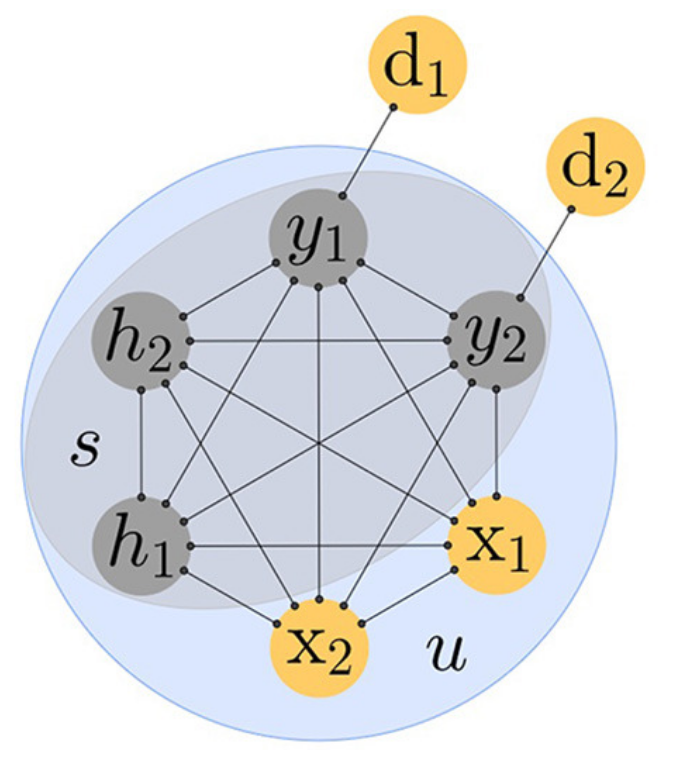

# Using physics to train neural networks: a conversation with Ben Scellier

By Tatsuhiro Onodera

Recently, I had the chance to attend the [Frontiers of Neuromorphic Computing conference](https://indico.mpl.mpg.de/event/15/) in Erlangen, Germany. The conference was well-organized, featuring excellent speakers and an ideal size that made it easy for everyone to interact. Thus, Logan and I realized that this would be a great opportunity to write a blog post centered around at a scientific result that interests us, and to interview a scientist who has done pioneering work in this space at the conference.

Since this is our first time writing a blog post of this kind, I want to start by providing an idea of its structure. First, I'll offer a quick summary of the emerging field that explores "self-learning through physics-based neural networks." After that, the post will transition into a conversation I had with Ben, focusing on how he got into the field of computing with physical systems. Inspired by the podcast [“What’s your problem?”](https://www.pushkin.fm/podcasts/whats-your-problem), we'll conclude with a lightning round of questions where I ask Ben two quick questions and share his answers.

# A quick introduction to self-learning with equilibrium propagation

Physical learning is a novel paradigm where physical systems learn to perform a task without reliance on an external digital computer, as data is fed to the system. Unlike classical deep learning on a digital computer that relies on a Von-Neumann architecture where memory, computation, and algorithm is separate — a physical computer that self-learns intertwine the physical medium and the computational algorithm. The aspirational dream example of self-learning is our own brains, where we learn by being exposed to new experiences (aka there is no external computer governing our learning)!

Beyond being a scientifically interesting and deep subject, self-learning is also of technological importance for two reasons. First, it may enable energy efficient training as physical learning systems can leverage the natural dynamics of the system for computation/learning without needing large amounts of energy to control the learning process. Second, in the long term, it could enable extremely large and complex neural networks with more parameters than we can obtain with conventional means, as the system learns on it’s own in a decentralized, non-global way (again a crude example of this is human intelligence). The dream of physical learning is, in short, to make a kind of artificial, or alien, brain, one that learns to compute entirely by experience and its own physical laws, not by following the orders of a digital computer. 

[Introduced by Ben Scellier and Yoshua Bengio in 2017](http://journal.frontiersin.org/article/10.3389/fncom.2017.00024/full), equilibrium propagation (EP) is a prominent framework in the domain of physics-driven-learning. In the following, I will be providing a quick introduction to it. As a firm believer of the principle that *good explanations provide the truth, but not the whole truth*, the following will provide a simplified (perhaps over-simplified) explanation -- please see the paper for the full detail.

The model of computation used in EP is fundamentally different from that found in regular feedforward multilayer neural networks, as it relies on bidirectional connections/weights and is described in continuous time as a dynamical system. In particular, EP uses an energy-based model, which is to say that the *dynamics of the systems naturally decreases the energy*. For simplicity, let’s assume the energy takes the simplest quadratic form:

$$E(u) = - \sum_{ij} W_{ij} u_i u_j$$

This is a gradient dynamical system, which means it obeys the following linear ODE:

$$\dot u_i = - \frac{\partial E}{\partial u_i} = \sum_{j} W_{ij} u_j$$

To most easily relate to these equations as a physicist, imagine that $u_i$ represents the displacements of objects in 1D that are connected by springs with coupling constant $W_{ij}$. Now why isn't there a momentum variable, as we have learned in physics 101? The reason is that this system essentially resides in a highly viscous liquid, such that the momentum variable is essentially frozen out (for the mathematically inclined: one can derive this formally with adiabatic elimination). In other words, the dissipation is large enough that the system is always over-damped and does not show any oscillatory characteristics. For other physicists that are closer to condensed matter, it may be easier to reason about this as a spin-glass. In any case, a positive $W_{ij}$ seeks to align two nodes (make $u_i$  and $u_j$ adopt the same sign), while a negative $W_{ij}$ does the opposite.

To perform machine learning with this system, we need some way to encode data into it. We will be dealing with supervised learning, so there will be inputs $x^{(\text{ML})}_i$ and outputs $y^{(\text{ML})}_i$, and the goal is to learn, based on known examples, a desired transformation from inputs to outputs. Similar to a Boltzmann machine, we can encode the desired information in some set of nodes (see figure above). Thus, some nodes in the dynamical systems will be *clamped* (aka fixed to some value for all time) to represent input data $u_i(t) = x_i^{\text{(ML)}},  \forall t$. On the other hand, there will be some nodes in the system that we want to directly correspond to the predicted outputs after **equilibration** (ideally $u_i(t\rightarrow \infty) = y_i^{\text{(ML)}}$). The rest of the nodes in the system are known as hidden nodes (represented as $h_i$ in the figure) which are essentially there to increase the information processing capacity of the network.

To train the network via self-learning, the high level approach taken by Equilibrium Propagation is to have 2 different phases, the "free-phase" and the "clamped-phase". In both phases, the state of the oscillators are measured and is used to update the weights $W_{ij}$ via an update rule. More specifically, it works as follows:

1. **Free-phase**: With the input oscillators are clamped to the machine data, and the dynamical system is evolved for a long time (ideally to equilibrium). Then measure the state of the oscillators in the system, which is denoted as $u^{\text{free}}$. This phase is called "free" because the output oscillators are free to evolve as they would like. This can also be thought of as the inference phase (like the forward pass in a regular NN), as in inference phase, the final value of the output oscillators give us the output of the machine learning task. This is thus the phase we'd leave the system in if we wanted to just perform inference (i.e., if we were satisfied with what had been learned and wanted to just use the trained system to compute).

2. **Clamped-phase**: In this phase, the output oscillators are clamped to the true target data. Note that the true target data is available as we performing supervised learning, where there is a set of input data and corresponding target data. The clamping can be done in several ways. The traditional way (constrastive Hebbian learning) enforces that the output oscillators are completely clamped to the target data. In EP, the output oscillators are nudged towards the target data, by introducing auxiliary oscillators (shown as $d_1$ and $d_2$ in the figure above). With this nudged clamping in place, and input oscillators still being clamped to the input data, the dynamical system is allowed to evolve (according to physical laws above) for a long time (ideally to equilibrium). The state of the oscillators in the system are measured, and denoted as $u^{\text{clamped}}$. 

3. **Update Weights**: The weights are updated according to the following rule:
$$ \Delta W_{ij} \propto u^{\text{clamped}}_i u^{\text{clamped}}_j - u^{\text{free}}_i u^{\text{free}}_j $$ 
Why this formula? The answer lies in the definition of the energy function of the network. Given a configuration $u$, the energy of the network is given by $E(u, W) = - \sum_{ij} W_{ij} u_i u_j$. Thus, we can see this update rules as trying to change the network in a way to favor the configurations of the clamped phase, and disfavor the configurations that of the free phase. This makes sense as the objective in supervised learning is to make the network output the correct output when the input is given. Mathematically, this intuitive statement is formally true as one can show that the update rule above is equivalent to: $$\Delta W_{ij} \propto - \frac{\partial }{\partial W_{ij}}(E(u^{\text{clamped}}, W) - E(u^{\text{free}}, W)).$$

To put things back to the original topic of self-learning in physical systems. We see that by following the above three steps, one is able to train a neural network to perform some desired task, without the need of an external computer. Instead, one simply reuses the physical system that is used to perform the computation in different configurations, to figure out how to gradually morph the system to perform the desired task.

---

Having explained the context of the field -- this is a good time to summarize Ben's key contributions to the field. The key innovation of EP is introducing this subtle approach of nudging the network, and mathematically proving that this approach results in accurate gradients (of the cost function) in the limit of small nudges. This is an important contribution because in contrastive Hebbian learning the nudges are large and the gradient is not accurate. Given the great success of gradient descent in training large deep neural networks, being able to say that a physical learning algorithm is equivalent, even asymptotically, is a big deal! 

Perhaps even more importantly, he with his supervisor Yoshua Bengio made the connection that these types of algorithms could have important implications as physical algorithms for real physical hardware (rather than as algorithms for digital machine learning), and hence for the design of novel physical hardware for machine learning.    

## How Ben got into the field of physical computing

Ben completed his Master's degree in applied mathematics from École Polytechnique in France and the National University of Singapore in 2015. Shortly thereafter, he took up a role as a data scientist in Singapore. It was during this period that a friend introduced him to the backpropagation algorithm and the field of deep learning. Struck by the algorithm's simplicity and its fascinating links to neuroscience, Ben found himself captivated. He spent his evenings diving into the subject, completing Geoffrey Hinton's deep learning course and poring over academic papers. His dedication even led him to develop a graphical interface for visualizing deep belief networks.

This self-directed learning journey had a rewarding outcome: he reached out to Yoshua Bengio with screenshots of his GUI and eventually secured a spot to pursue his PhD in Bengio's research group. Once enrolled, Ben continued to explore his interest in understanding the brain as a computational machine. He began to investigate how the brain's computational principles could inform the design of more efficient physical computing systems.

I found Ben's journey particularly engaging, not least because he comes from a background in mathematics rather than physics, which is more typical for the field of computing with novel physical systems. His story underscores the value of having a diverse range of perspectives in research, enriching the environment for groundbreaking work. It also serves as a reminder for aspiring researchers: if you're passionate about a field, immerse yourself in independent study, and follow it up with an email!

## Lightning-round questions

1. What is the coolest paper that you read this year?

	> [Dual Propagation: Accelerating Contrastive Hebbian Learning with Dyadic Neurons](https://arxiv.org/abs/2302.01228) - They managed to do extremely fast inference by minimizing some functional with one forward pass!

2. What is your best estimate for the probability for a non-digital electronics hardware to conquer a decent market share (~10%) of digital electronics hardware for computing in the next 10 years?

	> Probably negligible (<1%) in the next 10 years. In my view, the most significant technological leap on the horizon is digital in-memory computing, a direction that companies like Rain Computing are actively exploring. This will be followed by adding some select analog components, which will start performing some computationally expensive part of the computation (such as using memristers for matrix-vector products). Overall, I anticipate a hybrid landscape where computation is executed through a blend of analog and digital components for the foreseeable future.
