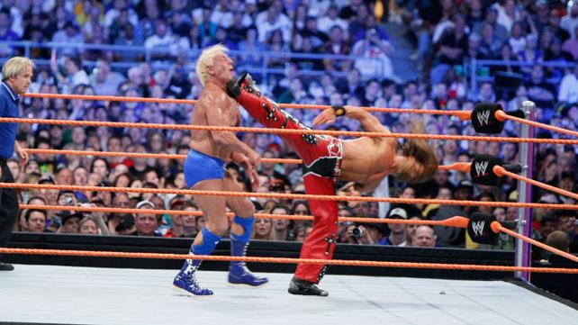
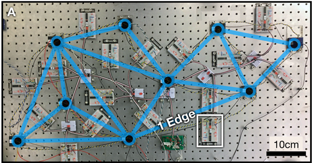

# Using physics to train neural networks and to understand the universe: a conversation with Nachi Stern

By Logan Wright

As a complement to Hiro's post on equilibrium propagation, I interviewed Menachem  "Nachi" Stern, who visited Yale recently to talk about physics-driven learning.

Physics-driven learning or "self-learning" means "getting a physical system to learn to do something on its own". Here, "on its own" means it is alone with only the physics of its own independent self to make use of - it most certainly should not need any digital computer to oversee or direct the process. In this context, "something" typically means "a useful computation", such as performing a neural network inference. But really, physical systems like this are learning a complex physical function - something you might even describe as a "behavior", since it is essentially a complex reaction to an input stimulus. Finally, "learns" means the physical system adjusts its own physical configuration incrementally in response to stimuli, kind of like how a biological organism like a dog (or a human) can learn to adjust its behavior to accomplish a goal (remember: this learning process involves changing the physical configuration of the brain). Of course, the field of physical learning is so far focused on physical learners that are much less complex than these biological organisms, devices sufficiently simple that to speak of "behavior", "agency" or "intent" is perhaps a bit of an exaggeration. Nonetheless, there is deep and fundamental connection between neuroscience, psychology, and physical learning. In a way, the question of how to orchestrate scalable physics-driven learning is a question of how to make an artificial alien brain - it's a question that gets more and more fundamental (and more and more weird) the longer you wrestle with it. Talking with Nachi was especially fun because he has, to put it mildly, wrestled with this question a lot. 

 (Dramatic re-enactment: Nachi Stern (played by Shawn Michaels) faces off against Physics-Driven-Learning (Ric Flair), image credit: WWE.com)

Nachi and I spoke as he was gearing up to transition from a post-doc at Penn, where he worked with physicists Douglas Durian and Andrea Liu and has grappled with physics-driven learning with his experimentalist colleague and tag-team partner, post-doc Sam Dillavou. In August 2024, Nachi will move to AMOLF in the Netherlands to start his new research group there.

Talking with Nachi was exciting because his long fued with physics-driven learning has spanned across many diverse perspectives and settings. Nachi started in Israel, at Tel Aviv learning statistical physics and simulations of lattice glasses. His PhD, with Arvind Murugan at the University of Chicago, featured his first bout with the question of physics-driven learning, culminating in a scientific steel cage match to design metamaterials (like folded paper) that can learn to recognize mechanical stimuli. Arvind's group is a biophysics lab that has approached this question through the framing of "learning without neurons", a version of the question that invites rewiring our perspective on adaptation in natural complex systems through the lens (and methods) of learning. During his post-doc at Penn, whose mission Nachi humbly described as "applying contrastive learning to physical systems", the feud has gotten more experimental, and more electric - together with Sam, Douglas, Andrea, and several other colleagues, Nachi helped to make some of the first proof-of-concept systems that self-learn, using networks of analog electronic circuits (and whose meticulous breadboards inspire in me a kind of nostalgic terror of long-forgotten circuits labs). 

 (A small physics-driven electrical learner built by Sam Dillavou at University of Pennsylvania, see [Demonstration of Decentralized, Physics-Driven Learning](https://arxiv.org/abs/2108.00275))

Broadly speaking (and neglecting a lot of specific innovations), the approach to physics-driven learning Nachi and colleagues have advanced is similar to equilibrium propagation, similar enough I don't need to introduce any additional equations beyond Hiro's earlier post. Often, however, Nachi and colleagues have introduced small distinctions. While these distinctions have in some cases meant that there is no longer an easily identifiable asymptotic connection to "perfect" gradient descent (as was a key claim of equilibrium propagation), they can dramatically simplify experiments (and might also simplify scaling them up). Most recently, the team has tackled some inevitable sub-questions that arise when we think about large-scale physics-driven learning, such as realizing learning in an asynchronous way (so we don't need a global clock), without reaching equilibrium (so we can go faster), and with nonlinearity (so we can implement complex transformations). Integrating all these demonstrations together, the message of all of Nachi's work is simple: the dream of physics-driven learning -- at scale -- is almost certainly possible. But what it all means might be even more exciting.

To Nachi, the ultimate goal - to truly realize the quest of physics-driven learning -- is not to build a brain. Or, at least, it isn't just to build a brain. Nachi said the real question is perhaps even bigger (yes, even bigger than building an alien superbrain): Is there a new physical concept or law - a "universal nugget" - that spans across and unites all systems that exhibit learning and adaptation. Is there something - a fundamental, universal phenomenon behind and uniting all complex adaptation and evolution? That question, whose answer seems like it could bring us to the center of ourselves and the universe simultaneously, views the quest of scalable physics-driven learning as an expedition of physics no less fundamental than resolving the origin of forces, particles, or time. 

## Lightning-round questions

1.What is the coolest paper/work that you read this year? (you can’t talk about your own work?) 

Nachi: A paper from Jen Shwarz's group, [Frequency propagation: Multi-mechanism learning in nonlinear physical networks](https://arxiv.org/abs/2208.08862). The problem with contrastive learning (and related methods) is that you need to compare two things. They solve this by applying the two signals in orthogonal physical modes, so they can coexist in the system at the same time. (Their demonstration uses an AC circuit where the two signals are at different frequencies, which reminded me of a similar paper by Wilfred van der Wiel's group, [Gradient Descent in Materio](https://arxiv.org/abs/2105.11233)) 

2. What should people do if they want to work on this topic?
	
Nachi: Study statistical physics (and/or maybe optimization). Think about non-convex optimization in the context of physics. There are connections to other things, other things that seem likely to be useful, like glass physics and information theory. To get into it, above all think about what is most exciting to you. The field of physics-driven learning is barely begun. If you've ever optimized anything, you know it's usually easiest to make big leaps in the beginning. When the field is new enough, mysterious enough, there are almost no wrong directions - that's where we are now. 

